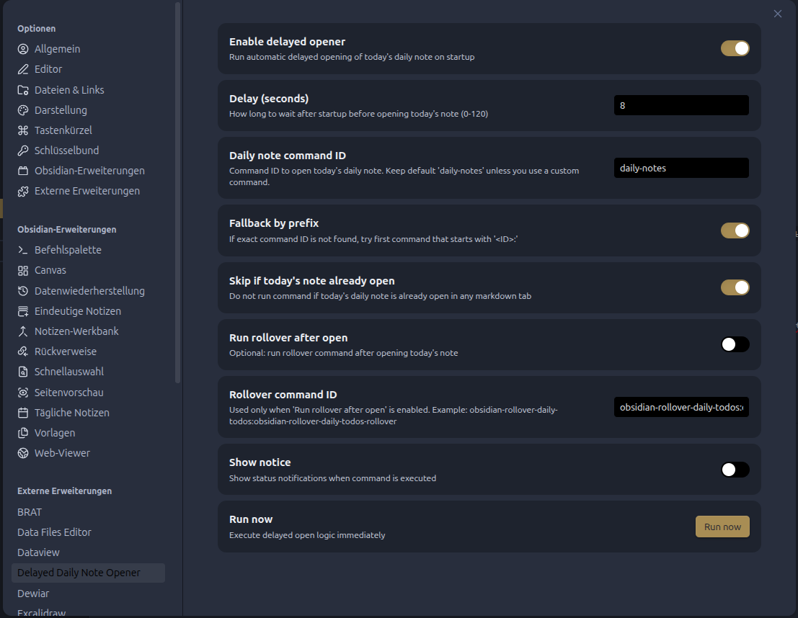

# Rollover Daily Todos Helper

An unofficial companion for [Rollover Daily Todos](https://github.com/lumoe/obsidian-rollover-daily-todos).

It opens today's daily note after a configurable startup delay so `Rollover Daily Todos` can reliably catch the note-creation event on desktop and Android.

## Why this plugin exists

On some setups (especially Android + synced vaults), today's note can be created very early during startup.
When that happens, plugins that listen to file creation events can miss the event.

This plugin delays the "open today's daily note" action so startup order is more reliable.

## Features

- Configurable startup delay (`0-120` seconds)
- Works on desktop and mobile (`isDesktopOnly: false`)
- Executes daily-note open command (default command ID: `daily-notes`)
- Fallback command resolution by prefix (`daily-notes:*`)
- Optional skip if today's note is already open
- Optional second command (run rollover after opening)
- Manual command and settings button: **Run now**

## Installation (manual)

1. Open your vault folder.
2. Create plugin directory:
   - `.obsidian/plugins/rollover-daily-todos-helper`
3. Copy these files into that directory:
   - `manifest.json`
   - `main.js`
   - `styles.css`
4. Restart Obsidian (or reload community plugins).
5. Enable **Rollover Daily Todos Helper** in Community Plugins.

## Recommended setup

1. Keep **Daily Notes** core plugin enabled.
2. In Obsidian app behavior, open **last file** on startup (not automatic daily note).
3. In this plugin, set delay to `5-10` seconds.
4. Keep `commandId = daily-notes` unless you use custom commands.

## Settings

- **Enable delayed opener**: turns startup behavior on/off.
- **Delay (seconds)**: wait time after layout ready.
- **Daily note command ID**: command to run (default `daily-notes`).
- **Fallback by prefix**: if exact command not found, tries first `daily-notes:*` command.
- **Skip if today's note already open**: avoids redundant execution.
- **Run rollover after open**: optional secondary command.
- **Rollover command ID**: default
  `obsidian-rollover-daily-todos:obsidian-rollover-daily-todos-rollover`.
- **Show notice**: show execution status notifications.

## Command IDs and localization

Obsidian command names can be localized, while command IDs are usually stable.
If your setup differs, set command ID manually in plugin settings.

## Known limitations

- If today's note already exists and your rollover plugin reacts only to file creation, opening it later may not trigger rollover automatically.
- In that case, either enable **Run rollover after open** or run rollover manually from command palette.

## License

MIT
